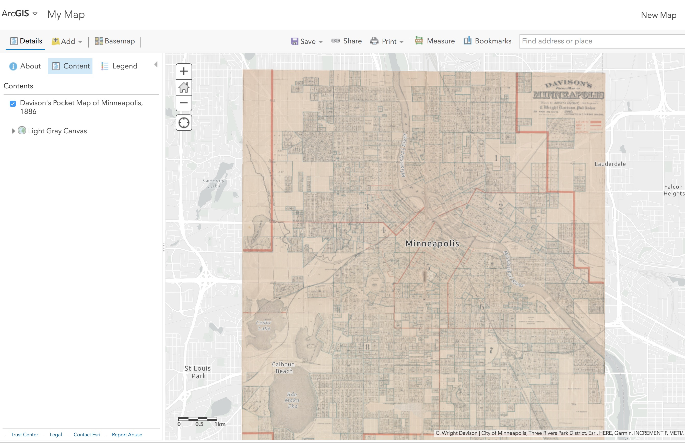

# Add Historic Maps to ArcGIS Online

## Introduction

We are going to add a tiled image layer to an ArcGIS online map. One common reason for doing so would be to add a historic map overlay to your project, or as a first step before digitizing details on a physical map to create new point, line or area features.

## Ingredients

You will need:

* An ArcGIS Online account 
* A georectified map hosted publicly online offering a tiled service

### ArcGIS Online

[ArcGIS Online](https://www.arcgis.com/home/index.html) is a widely used professional web mapping application. Many industries and higher ed institutions maintain subscriptions, so check with yours to see if you have access to an account.


If you don't have access to ArcGIS Online, you can sign up for a [free public account](https://www.arcgis.com/sharing/rest/oauth2/signup?client_id=arcgisonline&redirect_uri=http://www.arcgis.com&response_type=token) that offers basic map making capabilities.


### Georectified Map

A georectified map is an image that has geographic coordinates embedded in its metadata. With GIS software you can make your own, but they can also be hosted online and shared in various ways. We will use an already rectified map.


Some potential sources of rectified map images are:

* [MapWarper.net](https://mapwarper.net/)
* [New York Public Library MapWarper](http://maps.nypl.org/warper/)
* [David Rumsey Map Collection](https://www.davidrumsey.com/view/georeferenced-maps)


## How to do it

We are going to add this map as [web tiles](https://en.wikipedia.org/wiki/Tiled_web_map) so it will be served at higher resolution as we zoom in, the same way satellite map layers get displayed on Google and other maps services.

1 - Find a georectified map. You can use the one below from MapWarper.net for this demo:  
   [Davison's Pocket Map of Minneapolis, 1886](https://mapwarper.net/maps/38325#Preview_Rectified_Map_tab)

2 - Get the **URL in Tiles or XYZ format**, which should follow the format below   
   [https://mapwarper.net/maps/tile/38325/{z}/{x}/{y}.png](https://mapwarper.net/maps/tile/38325/{z}/{x}/{y}.png
)

3 - In **ArcGIS Online**, open a new or existing **Map**

4 - From the **Add Menu**, choose **Add Layer from Web** 

5 - In the data type drop down of the window that opens, choose **Tile Layer** 

5a - **Paste and edit the Tile URL to match the ArcGIS format**


This is the crucial step  — **change** {z}/{x}/{y} in the Tile URL to {level}/{col}/{row} as stated in the ArcGIS help text and illustrated below.


5b - OPTIONAL - Set the Extent to match the content you are mapping, e.g. in this case Minneapolis, MN.

6 - Click **Add Layer** and see your map overlaid.  

## How it works

The biggest challenge with displaying an image on a zoomable map is resolution. Digital images are raster data with a fixed number of discrete cells or pixels giving the image its resolution. High resolution images are large files, which can take a long time to load over the internt.


Read about the [difference between raster and vector data types for spatial data here](https://gisgeography.com/spatial-data-types-vector-raster/).


[Tiled web maps](https://en.wikipedia.org/wiki/Tiled_web_map) \(sometimes called slippy maps\), pioneered by Google Maps, get around this problem by breaking up a large image into a series of square tiles of different resolutions for different zoom levels. Only the tiles within the view frame at the current zoom level are loaded and swapped out for different ones when the user pans or zooms.

The basic principles are the same in all web mapping tools, but the format can vary. The key trick for using tiled web resources in ArcGIS online is to alter the URL to accommodate their format.


The crucial step to make tile maps work for ArcGIS Online is to change {z}/{x}/{y} in the Tile URL to {level}/{col}/{row} 


## Further Resources

* [ArcGIS Online help documents for adding a Tile Layer](https://doc.arcgis.com/en/arcgis-online/create-maps/add-layers.htm#ESRI_SECTION2_2C913FF2022B4DD29BF9DA6CB6014EDB)

