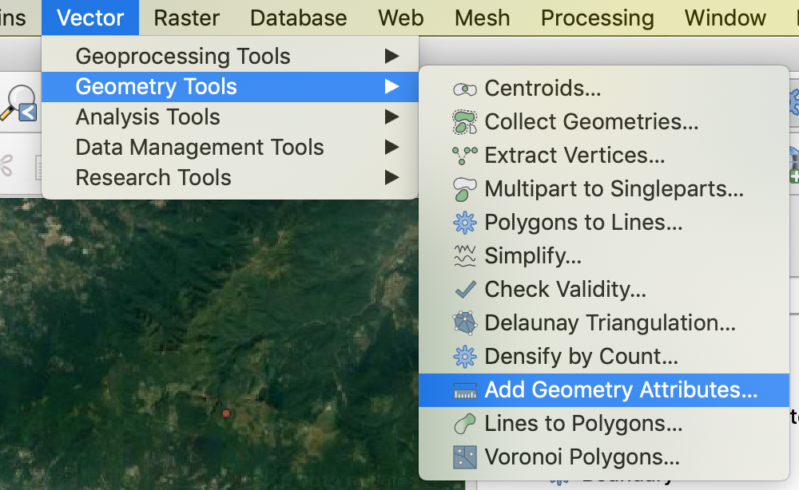

# Extract data from Google My Maps \(.kml\) into a .csv spreadsheet

## **Introduction**

This recipe focuses on extracting data from Google My Maps for other uses. Google My Maps is a platform where places can be pinned down visually on a Google map. However, if you want to play with the geo-data further in a non-visual way \(e.g. adding time data\), you can extract data from Google My Maps \(.kml\) and turn the data into a csv. spreadsheet.

## **Ingredients**

A map in [Google My Maps](https://wp.stolaf.edu/it/googlemymaps/).

[QGIS](https://qgis.org/en/site/forusers/download.html) installed.

## **How to do it**

1. Extract data from Google My Maps:

* On your Google My Maps, click the vertically-arranged three-dot sign \(at the top-right corner of the layer panel like the image below\) &gt; Click “Export to KML/KMZ.”

2. Use QGIS to convert the .kml file into a .csv spreadsheet:


If you do not have QGIS or have questions about converting .kml into a .csv spreadsheet, this [website](http://www.convertcsv.com/kml-to-csv.htm) can also potentially help you convert .kml files into .csv files.


* **Check again if there is latitude-longitude data:** Right-click the \(merged, geotery attribute added\) layer in QGIS &gt; Select “Open Attribute Table.” This time you should find “xcoord” \(which means longitude\) and “ycoord” \(which means latitude\).
* **Download the data:** Right-click the \(merged, with “xcoord” and “ycoord”\) layer you want to download &gt; Select “Export” &gt; Click “Save Features as” &gt; Look for the drop-down menu “Format” &gt; Select “Comma Separated Value \[CSV\]” &gt; Click the horizontally-arranged three-dot sign to name the file &gt; Click OK.
* **Make the latitude-longitude data readable across platforms** \(such as Carto, which can’t read “xcoord” or “ycoord,” but “longitude” and “latitude”\): In Google Sheets, open the .csv file you just downloaded. Change the label of “xcoord” into “Longitude,” and the label of “ycoord” into “Latitude.”

## **How it works**

Reasons to merge the layers of your Google My Maps in QGIS:

* If you merge the layers in QGIS, the exported data will be one single .csv spreadsheet, which is easier to do data management.
* If multiple layers are used, Carto might not animate all at once. Carto can animate one layer at a time.

## **Further resources**

‌Starting with Google My Maps **VS.** Starting with a .csv spreadsheet

* It makes sense to start with Google My Maps if the main goal is to pin down places visually on a Google map.
* It makes sense to start with a .csv spreadsheet, on the other hand, if the main goal is to compile “columns” of data, such as time, scale, degree of certainty, whether it is ambiguous \(see the recipes on certainty and ambiguity\).

Starting with Google My Maps **AND** Continuing with a .csv spreadsheet

* **Example 1:** To map a character’s walk tour in a novel, you can start with Google My Maps to pin down places visually on a Google map. Then, if you want to add time data \(i.e. when the character arrived at the places\) and/or use platforms such as Carto to animate the walking tour, you need to take the above steps to extract data from Google My Maps and turn the data into a .csv spreadsheet.
* **Example 2:** To map students’ walk tours while studying abroad, the students can start with Google My Maps to pin down places visually on a Google map. Then, if they want to add time data \(i.e. the time when the students arrived at the places\) and/or use platforms such as Carto to animate the walking tours, they need to take the above steps to extract data from Google My Maps and turn the data into a .csv spreadsheet.
* **Alternative approach for Example 2:** The students can use a smartphone app such as MotionX-GPS to track their walking tour \(Good thing: GPS doesn’t require cell-phone data. Warning: GPS only tracks outdoor motions\). Then, they can use the data \(which is already a combination of geo data and time data\) by emailing the data to themselves, downloading the data from email, and importing the data to platforms such as Carto and ArcGIS.

