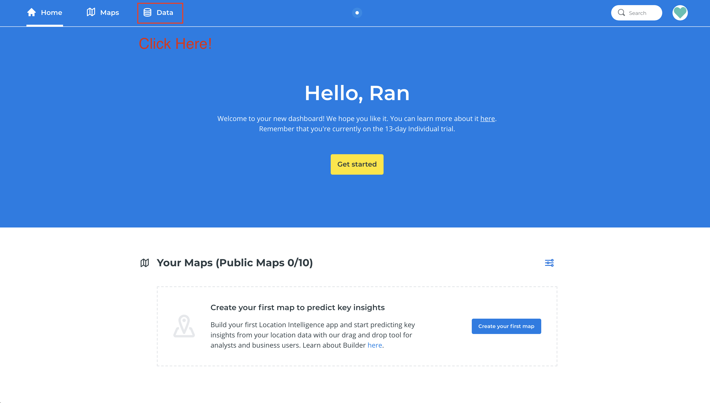

# Upload a dataset to Carto

## **Introduction**

This recipe focuses on uploading a dataset to Carto. See the separate recipe on using that dataset in Carto to make a map \[recipe does not exist\].

## **Ingredients**

You will need a dataset \(ideally, a CSV file\). However, Carto supports .xls \(Excel\) files, .zip files \(for uploading shapefiles\) as well as other extensions including .gpx.

You will need a free account/login for Carto. You can login with your Gmail account.


**WARNING:** Carto is a “freemium” mapping program. The standard free account is only a 14 day trial. You can extend your free account by emailing Carto and requesting an educator account.


## **How to do it**


**WARNING:** The steps below may be or appear different for users on the free trial.


1. Log in to Carto on the top right that reads “Try for free”
2. Navigate to the data tab at the top left.
3. Click on “New Dataset”
4. Upload your dataset as a file from your computer, or you can link your Carto account to your Google Drive account \(or Dropbox, etc.\).
5. Carto will automatically identify the columns with coordinates in your dataset. If there are none, it will prompt you to identify the location data in your dataset. You can use location names \(place names, street addresses, etc.\) instead of coordinates.
6. Your dataset will display in spreadsheet form. Click the “map view” at the top to visualize the data.‌

## **How it works**

Although Carto is very easy out of the box, the issues with limited free access could preclude any academic interest in the product.

## **Further Resources**

‌

