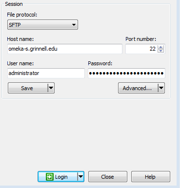

# Getting an Omeka Classic Neatline

## **The Intense Way**

One of your colleagues shows you a great online map and tells you it’s a Neatline map. You want to get your own Neatline, but how do you do that?

## **Ingredients**

‌Definitions:

* **Omeka Classic** – [Omeka](https://omeka.org/) is an open-source web-publishing software, specifically designed for library, museum, archives, and other scholarly collections. [Omeka Classic](https://omeka.org/classic/) is the original version of Omeka. The development community has moved to Omeka S, but Omeka Classic is still valuable for individual projects.
* **Neatline** – [Neatline](https://omeka.org/classic/plugins/Neatline/) is a framework for creating interactive versions of visual materials such as maps, paintings, and photographs. Neatline was built as a plugin for Omeka Classic. Find the documentation [here](http://docs.neatline.org/).
* **ssh** – ssh \(“secure shell”\) is a protocol for connecting and administering a computer that is not your own, in a secure manner. ssh applications often allow login, command-line, and remote execution of functions.
* **FTP** – FTP \(“file transfer protocol”\) is a protocol for transferring files between computers. Maybe called SFTP \(“secure file transfer protocol”\).

What you need:

* **Server**.
  * You will need a server with a Linux operating system. I am most familiar with Ubuntu operating systems, so these instructions may be Ubuntu-specific but should be similar to other Linux operating systems commands and behaviors. This server should have these components:
    * [Apache](http://www.apache.org/) HTTP \(with mods\_rewrite enabled\)
    * [MySQL](http://www.mysql.com/) version 5.0 or higher
      * Be sure you have the root password for MySQL.
    * [PHP](http://www.php.net/) version 5.3.2 or higher \(with mysqli and exif extensions installed\)
    * [ImageMagick](http://www.imagemagick.org/script/index.php)
  * Note: Linux with Apache, MySQL, and PHP is called a LAMP stack. If your IT starts talking about a LAMP stack, that is what they’re talking about.
  * The server will need to be open to ssh as well as be web-browsable. I recommend having these ports open:
    * 20, 21 \(FTP\)
    * 22, 23 \(ssh\)
    * 80, 8080 \(HTTP\)
    * 443 \(HTTPS\)
  * Also be sure that you have an administrator login and password for the server.
* **Someone familiar with administering Linux machines**.
  * This person can have only a basic/beginner understanding of administering a Linux OS.
  * This person will need ssh access to the above server.‌
* **A ssh client.**
  * This client will allow your Linux administrator and yourself to access the server for installing Omeka and any desired changes.
  * For Windows, a useful ssh client is [PuTTY](https://www.putty.org).
  * For Mac users, the Mac operating system has a [native ssh client](http://osxdaily.com/2017/04/28/howto-ssh-client-mac/).
* **An FTP client.**
  * An FTP is my preferred way to place files on the server.
  * Two FTP clients are [WinSCP](https://winscp.net/eng/index.php) and [CyberDuck](https://cyberduck.io/).

## **How to do it**

Once you have a server with the LAMP stack installed, you can begin installing Omeka Classic on your server. Creating a new Omeka instance involves extracting the archive into a new site directory, creating a database and database user for the new site, and completing the Omeka install script.

1. Download [Omeka Classic](https://omeka.org/classic/download/) to your computer.
2. Once you have the ZIP file \(or .tar.gz\) of Omeka Classic on your computer, you can upload the ZIP to your Omeka server.
   1. Open your FTP client, provide the IP or URL for the server as well as the login credentials to connect to your server. \(I’ve provided an example, using WinSCP.\)

* 1. Upload the ZIP to your server. I like first putting it in the administrator’s folder, which will look like /home/\[user\].
  2. Once the ZIP file is on your Omeka server, you can close out of your FTP client.

1. Once the ZIP file is on your Omeka server, ssh to your Omeka server using a ssh client.
2. When the server opens, you will be prompted to login. Provide your administrator’s username \(“login”\) and password. You have logged into the server.
3. Navigate to your home directory.

cd /home/\[user\]

You should then see your Omeka Classic ZIP file.

1. You can unzip the file. Here are two ways to unzip a file.

unzip \[filename\]

tar –xvzf \[filename\]

1. Move the _unzipped_ file to the web directory \(in newer Ubuntu versions, the web directory is /var/www/html\). Note: the file will be a directory or “folder.” 

Sudo mv \[unzipped filename\] /var/www/html/\[unzipped file name\]  

1. Navigate to your web directory to verify your unzipped file is there. 

cd /var/www/html  

1. Rename the Omeka directory to the name of the site you’d like to create. For example, I’ll use Studs Lonigan. 

sudo mv omeka-2.4.1 StudsLonigan

1. Now, you have the Omeka Classic website done, but it still needs a database underneath it \(to hold all of the information you want to display on Omeka\). Login to MySQL, on the server.

mysql –u root –p

After the “-p”, you will be asked to provide a password. Make sure to use your MySQL password.

If you have an Ubuntu 18.04 or later, you may have to use the following command and provide the administrator password.

sudo mysql –u root –p

1. One of the above options will log you into MySQL. You’ll then need to create a database, as well as a user and user password, for your Omeka Classic site. I recommend giving the database and the username the same as the Omeka site’s directory. You will then be giving permissions for the user to edit the database, so that you can make edits to your site through the web site \(which will communicate to your database using the username and password\). Then, you can exit MySQL \(shown below\).

CREATE USER 'StudsLonigan'@'localhost' IDENTIFIED BY 'password';

CREATE DATABASE StudsLonigan;

GRANT ALL PRIVILEGES ON \`StudsLonigan\` . \* TO 'StudsLonigan'@'localhost';

exit;

1. Now that you have the database and MySQL user all set up, you will need to edit the db.ini file so that your Omeka website knows to use the database you just created. You get to the db.ini by navigating to your website’s directory.

cd /var/www/html/StudsLonigan

Then, use a text editor \(included with your Linux operating\), such as vi or nano to edit the db.ini file.

sudo nano db.ini

 Your text editor will open the file and allow you to make edits. Edit db.ini so it contains:

\[database\]

host = "localhost"

username = "StudsLonigan"

password = "password"

dbname = "StudsLonigan"

prefix = ""

charset = "utf8"

Ensure that you use your database’s password in the password area, as well.

You can then exit your text editor.

1. Change the ownership of your site’s directory, so that you can write to your website from the web.

sudo /var/www/html/StudsLonigan

sudo chown -R vagrant:www-data .

1. Then, change permissions for the directory, so that you can upload files to your site.

sudo chmod -R 774 files

1. Also change permissions for the plugin directory inside your Omeka directory.

cd /var/www/html/StudsLonigan/plugins

sudo setfacl -m g:admins:rwx .

1. Then, navigate to your site in a web browser to complete the setup of your site.

You have now set up your Omeka website. The instructions to install Neatline can be found [here](https://docs.neatline.org/installing-neatline.html).

The instructions recommend putting the unzipped Neatline file/folder into the ./plugins area of your Omeka directory. You can use your FTP client as described in Step 2 above. You simply need to click through the folders until you reach your plugins directory.

If your server’s security settings don’t allow you to FTP directly to that directory, you can also FTP your Neatline folder to your server’s /home/\[username\] directory and then the Linux move command \(like in Step 9 above\) to move Neatline from the home directory to the plugins directory.

sudo mv /home/\[username\]/Neatline /var/www/html/plugins/

Then continue to the web browser to install Neatline through Omeka.

‌

**How it works**

‌

‌

**Further Resources**

‌

Interested in working in Linux systems? Check out these resources:

* [LinuxCommand](http://linuxcommand.org/)
* CodeCademy’s [Learn the Command Line](https://www.codecademy.com/learn/learn-the-command-line)
* [Linux Command Line Tutorial for Beginners](https://youtu.be/YHFzr-akOas)

